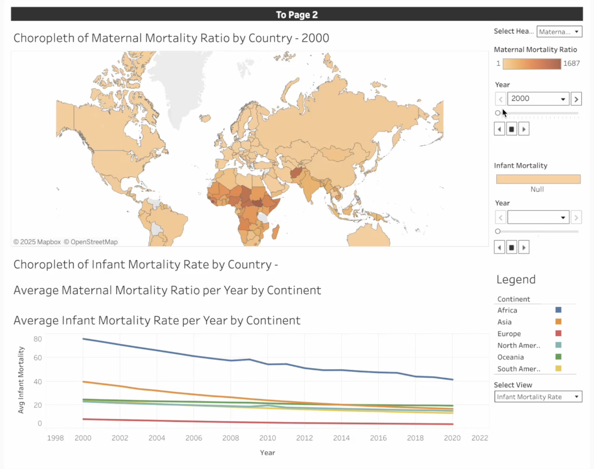

# sdg-challenge-2025-MAMA

This repository contains the EDA notebooks and policy brief made for the 2025 UTSC SDG Data Challenge. Our group's demo of our solution, MAMA, and the accompanying Tableau dashboard and policy brief can be found [here](https://youtu.be/-62zBWc5n-4), or by clicking the image below. Our group and solution, MAMA, won the "Best Insights Award" for original and insightful analysis.

Our issue: Maternal and infant mortality in Northern and Central Africa remains a critical public health crisis—rooted in systemic gaps in healthcare access, education, and early intervention—demanding immediate policy action to strengthen maternal health systems and fulfill international commitments under SDG 3.

Our solution: Maternal Analytics & Monitoring Alliance (MAMA): A centralized Smart Birth Registry and Maternal Health Watchlist will enroll pregnant women at UNICEF/UNW mobile clinics in high-risk areas to track maternal and child health from pregnancy to age 5, using machine learning to identify at-risk mothers, guide mobile clinic deployment, and deliver personalized care reminders via SMS/WhatsApp or mobile apps in partnership with local NGOs.